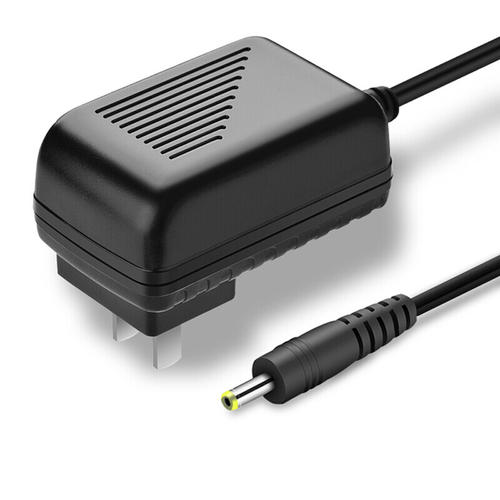

# Qualcomm® QRB2210 Open Kits DarkEnhance-demo Developer documentation

## Introduce

The project is based on the source code of the QRB2210 development kit system and runs on the QRB2210 development board, making full use of the diversification and powerful connection and computing capabilities of the development kit. Opencv was used to load the image and calculate the image brightness. For images with brightness below 200, libtorch and Zero-DCE models are used for brightness enhancement. Both processed and unprocessed images are stored in the r_images directory, and Opencv is used to generate new images.

Wants to make some low light image brightness can get more enhanced image information, and apply to the subsequent some scenarios.

Qualcomm® QRB2210 SoC Open Kits


## Materials and Tools used for the project

1. Hardware materials

Except for the Open Kits,The following hardware materials are also needed:

* Type-C usb line

using the usb line to develop on Qualcomm® QRB2210 SoC Open Kits.


* Charger

Direct power supply for Qualcomm® QRB2210 SoC Open Kits.



## Environment configuration

This section mainly describes the source and configuration of some open source projects or third-party tools needed in the development process.

### Opencv
OpenCV is a cross-platform computer vision and machine learning software library distributed under the Apache2.0 license (open source).  <br>
url: https://opencv.org/

### liborch
LibTorch is a C++ library for PyTorch that provides functionality and interfaces for executing PyTorch models in a C++ environment. LibTorch allows developers to use PyTorch for model training and inference without Python.<br>
url: https://github.com/pytorch/pytorch

### OpenBLAS
OpenBLAS is an open source based on BLAS (Basic Linear Algebra Subprograms) of the standard Linear Algebra library. It provides a set of high-performance, optimized linear algebra functions, including matrix multiplication, vector operations, matrix factorization, and more.<br>
url: https://github.com/xianyi/OpenBLAS

## Compile
No special compilation method is required. After configuring the RB1 special SDK, the product can be generated directly by Cmake compilation.

## Configure and Usage
Start the RB1 and connection RB1 to host by Type-c usb.
### 1. Configure
(1) Prepare the preprocessed image and put it into the DarkEnhance executable sibling directory images.<br>
(2) Prepare the dynamic library files required by DarkEnhance executable programs such as libtorch.so. Place them in thrid-patry_librarys, a sibling of the directory where the DarkEnhance executable is located;<br>
(3)Prepare the Zero-DCE model.pt file and place it in the cfg directory, a sibling of the DarkEnhance executable.<br>
(4) Execute the DarkEnhance executable.

### 2. Usage
The executable file under the bin directory does not need additional parameters, just put cfg, thrid-patry_librarys, images three directories in the corresponding position can be.

```
adb push ./cfg /data
adb push ./images /data
adb push ./thrid-patry_librarys/<libname> /lib
adb push ./DarkEnhance /data/exefile
adb shell
cd data/exefile
./DarkEnhance 
```

The processed image is stored in the r_images directory and the brightness of the image before and after processing is printed to the terminal.

**result show**</br>
[image1.png](./res/image1.png)&nbsp;&nbsp;&nbsp;&nbsp;&nbsp;&nbsp;[r_image1.png](./res/r_image1.png)&nbsp;&nbsp;&nbsp;&nbsp;&nbsp;&nbsp;[image2.png](./res/image2.png)&nbsp;&nbsp;&nbsp;&nbsp;&nbsp;&nbsp;[r_image2.png](./res/r_image2.png)

<div style="display:flex;justify-content:space-between;;margin-top:20px;">
  
  
</div>
<div style="display:flex;justify-content:space-between;margin-top:40px;">
  
  
</div>
